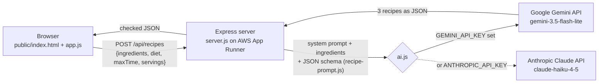

# Fridge to Fork

An AI recipe maker. Add the ingredients you have, choose a diet, a cooking time and how many people you're feeding, and AI suggests three recipes that use them, plus anything extra you'd need to buy.

It runs on Google Gemini's free tier by default, and can use Anthropic Claude instead.

**Live app:** `https://<your-service>.<region>.awsapprunner.com` (replace after deploying)

## The problem it solves

People throw away food because they can't think what to make with what's already in the fridge. Recipe sites start from a dish, not from your ingredients. Fridge to Fork starts from your ingredients and works backwards.

## How it works



1. The browser loads the frontend (`public/`) from the Express server.
2. Clicking **Find recipes** sends the ingredient list to `POST /api/recipes`.
3. The server validates the input, then `ai.js` sends it to the AI with a system prompt (cooking and safety rules) and a JSON schema, so the AI must reply in a fixed recipe format.
4. The server double-checks the AI's JSON (`cleanReply` in `recipe-prompt.js`) and returns it; the frontend draws the recipes as cards.

The AI key stays on the server as an environment variable. The browser never sees it.

## Project structure

```
fridge-to-fork/
├── server.js            Web server: serves the site, validates input, /api/recipes, /health
├── ai.js                Picks the AI (Gemini or Claude), calls it, turns errors into clear messages
├── recipe-prompt.js     The AI's instructions, the recipe JSON schema, and the reply checker
├── scripts/
│   └── check-key.js     "npm run check-key": tests your AI key with one small request
├── public/              Frontend (plain HTML, CSS and JavaScript, no build step)
│   ├── index.html       Page structure and the recipe card template
│   ├── style.css        Styles: ruled recipe-card look, mobile layout
│   ├── app.js           Ingredient chips, buttons, fetch call, renders recipe cards
│   └── fonts/           Self-hosted open-source fonts (SIL Open Font License)
├── package.json         Dependencies and the start / dev / check-key scripts
├── package-lock.json    Exact dependency versions, used by "npm ci" in the build
├── .env.example         Template for the environment variables (no real secrets)
└── .gitignore           Keeps node_modules and .env out of GitHub
```

## Responsible AI

| Risk | What the app does |
| --- | --- |
| Wrong or unsafe cooking advice | System prompt requires safe cooking temperatures; every card lists allergens; the footer says AI output can be wrong and names the model |
| Hidden ingredients the user doesn't have | Extras are listed separately under "You'll also need" |
| Prompt injection or off-topic use | Ingredients are wrapped in tags and treated as data; non-food input returns a "not food" message instead of recipes |
| Broken or malicious AI output on the page | A JSON schema constrains the reply, the server re-checks every field, and the frontend inserts AI text with `textContent`, never `innerHTML` |
| Leaked API key | Key lives only in an environment variable; `.env` is git-ignored |
| Abuse and runaway use | Max 20 ingredients of 40 characters each; 10 requests per minute per IP; 10 KB request limit |
| Privacy | The app stores nothing, and logs record only method, path, status and timing. On Gemini's free tier Google may use prompts to improve its products, so the footer tells users not to type personal information |

## Run it locally

You need Node.js 22.9 or newer and an AI key.

1. Get a free Gemini key: go to [Google AI Studio](https://aistudio.google.com/apikey), sign in with a Google account, and choose **Create API key**. No credit card is needed.
2. In this folder:

```bash
cp .env.example .env      # then replace your-gemini-api-key-here with your key
npm install
npm run check-key         # sends one test request and tells you if the key works
npm run dev               # starts the server and restarts it when you edit
```

3. Open http://localhost:8080

The free tier has per-minute and per-day request limits. You can see yours on the [rate limit page in AI Studio](https://aistudio.google.com/rate-limit). If the app says it has reached its usage limit, wait a minute, or until the next day.

To use Claude instead, put `ANTHROPIC_API_KEY=...` in `.env` and remove the Gemini line (or set `AI_PROVIDER=claude`). Claude's API is paid.

## Deploy to AWS App Runner

### 1. Put the code on GitHub

Create an empty repository on GitHub (no README), then in this folder:

```bash
git init
git add .
git commit -m "Initial commit: Fridge to Fork AI recipe app"
git branch -M main
git remote add origin https://github.com/<your-username>/fridge-to-fork.git
git push -u origin main
```

Check on GitHub that `.env` and `node_modules` are **not** there.

### 2. Create the App Runner service

App Runner stopped accepting new AWS customers on April 30, 2026. If your account has never used App Runner, the console may not let you create a service; tell your instructor straight away.

1. Open the [App Runner console](https://console.aws.amazon.com/apprunner) and choose **Create service**.
2. **Source:** Repository type **Source code repository**, provider **GitHub**.
   - First time only: choose **Add new**, then **Install another**, install the **AWS Connector for GitHub** on your account and give it access to this repository.
   - Repository: `fridge-to-fork`, branch `main`, source directory `/`.
3. **Deployment settings:** **Automatic**, so every push to `main` deploys.
4. **Build settings:** choose **Configure all settings here**.
   - Runtime: **Nodejs 22**
   - Build command: `npm ci`
   - Start command: `npm start`
   - Port: `8080`
5. **Service settings:**
   - Service name: `fridge-to-fork`
   - CPU and memory: **0.25 vCPU, 0.5 GB** is enough for this app and costs the least.
   - Environment variables: add `GEMINI_API_KEY` with your key as the value.
6. **Health check:** protocol **HTTP**, path `/health`.
7. Choose **Next**, then **Create & deploy**. The first deployment takes about 5 to 10 minutes.
8. When the status shows **Running**, open the **Default domain** link. That's your live app.

**Why there's no `apprunner.yaml`:** when a repository uses that file, App Runner ignores environment variables set in the console, which would force the API key into the repo. Configuring the build in the console keeps the key out of GitHub.

### 3. Updating the app

Edit, commit and push to `main`. App Runner detects the commit, runs `npm ci`, starts the new version with `npm start`, checks `/health`, and switches traffic over. If the health check fails, the old version keeps running.

To save money when you're not using it, choose **Actions → Pause service** in App Runner, and **Resume** before your demo.

## Tech

Node.js 22, Express 4, Google Gen AI SDK (`@google/genai`) with Gemini 3.5 Flash-Lite (`gemini-3.5-flash-lite`, free tier), Anthropic SDK with Claude Haiku 4.5 (optional), plain HTML/CSS/JS, AWS App Runner, GitHub.

`gemini-3.5-flash-lite` is scheduled to shut down on May 7, 2027. To switch models, set `GEMINI_MODEL` (for example `gemini-3.8-flash`) without changing any code.
